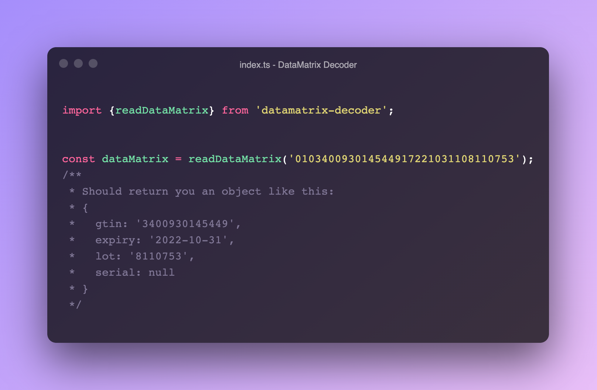

# DataMatrix Decoder



[](https://github.com/ExactCure/datamatrix-decoder/actions/workflows/webpack.yml)


## Description:
Decoder for medical datamatrix, this library extract and export the essentials information contain into a DataMatrix.
## How  to use ?
Install the dependency with npm:
```
npm install datamatrix-decoder
```
or with warn:
```
yarn add datamatrix-decoder
```

## Example:

```typescript
import {readDataMatrix} from 'datamatrix-decoder'


const dataMatrix = readDataMatrix('010340093014544917221031108110753')
/**
 * Should return you an object like:
 * {
 *   gtin: '3400930145449',
 *   expiry: '2022-10-31',
 *   lot: '8110753',
 *   serial: null
 * }
 *
 * /

```
